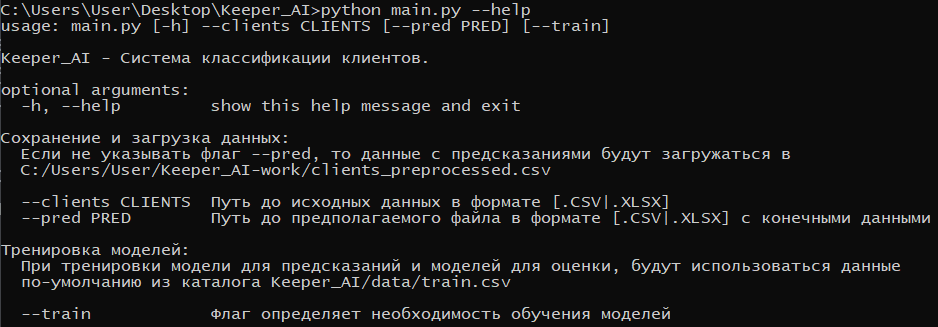

# **Keeper_AI - Система классификации клиентов**
****
Keeper_AI - Система классификации клиента на предмет того, как скоро он перестанет пользоваться услугами бизнеса

**Пример работы с системой:**
- `Win`+`R` -> `cmd`
- `cd Keeper_AI` -> `python main.py --clients YOUR_PATH --pred YOUR_PATH --train`

**Обозначения**:
- флаг `--clients` обзначает путь, до данных с клиентами 
- флаг `--pred` обзначает путь, до предполагаемого файла с предсказаниями модели о клиентах. По умолчанию: `C:/Users/User/Keeper_AI-work/clients_preprocessed.csv`
- флаг `--train` - указывает системе на то, нужно ли предварительно обучать модель перед работой.   **Важное уточнение:** в каталоге с сохраненным данными с предсказаниями о клиентах должна быть папка `models/`. В противном случае обучение будет происходить в незавимости от того, был ли указан флаг, или нет

**Помощь при работе с системой:**
- `Win`+`R` -> `cmd`
- `cd Keeper_AI` -> `python main.py --help`
  
</img>

**Более подробная информация по работе с системой:** `doc/html/index.html`

<h2>Автор проекта</h2>

Улановский Иван:

<ol>
<li><a href="https://github.com/ivan-dev-lab">GitHub</a></li>
<li><a href="https://t.me/ivan_ne_chik06">Telegram</a></li>
</ol>